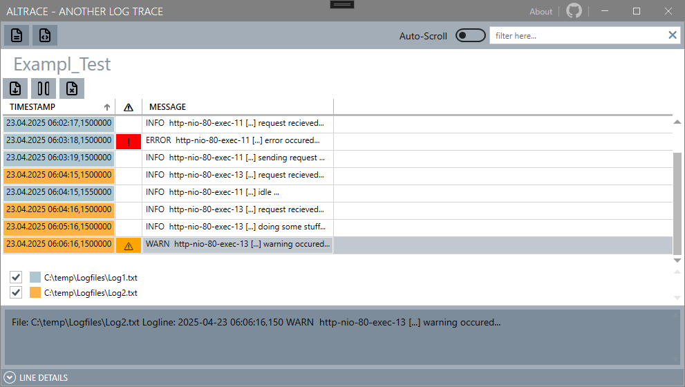
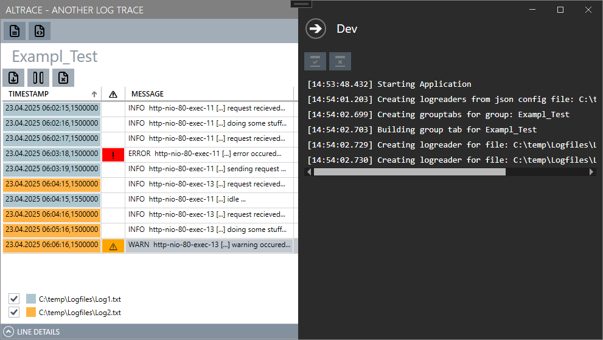
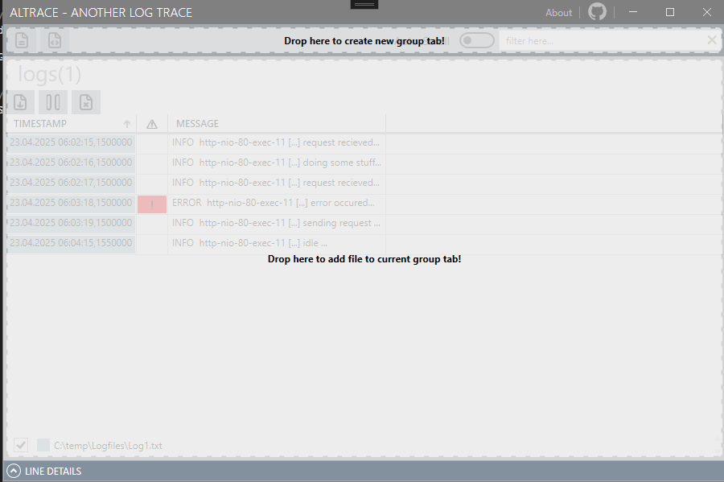

# Description

AnotherLogTrace is a lightweight log file viewer built for power users, system administrators, and developers. Inspired by CMTrace, it provides real-time log tailing, JSON configuration support, tab-based log grouping, drag-and-drop support, and an intuitive WPF UI styled with MahApps.Metro. Whether you work with structured or plain text logs, AnotherLogTrace helps you parse, filter, and analyze with ease.

## Features
- Open logfile(s) organised by json defined groups.
- Open logfile(s) by file open dialog.
- Open logfile(s) by drag and drop. Create new loggroup or add file to open log group.
- Open logfile via windows context menu.
- In-time creation of needed windows context menu entry "Open with Altrace".*
- Regex-extraction of timestamps from loglines
- Line-offset management for loglines without timestamp (e.g. exceptions).
- Filter by string match
- Auto-Scroll to bottom
- Pausable tracing of all opened logfiles 
- Expandable logline details panel for grid selected logline

*Press F11 for devconsole, if the program is started with administrative priviledges, buttons will be enabled.

No installation needed, for maximum flexability.

## Current restrictions:
- Only .log and .txt files supported.
- Only up to 30 concurrent open files.
- Performance can be bad, 10 concurrent logfiles á 10mb testet.
- Following timestamp formats supported, descending in match priority:
  - "yyyy-MM-dd HH:mm:ss,fff"
  - "yyyy-MM-ddTHH:mm:ss"
  - "yyyy-MM-dd HH:mm:ss"
  - "dd.MM.yyyy HH:mm:ss"
  - "MM/dd/yyyy HH:mm:ss"
  - "HH:mm:ss"
  - "yyyy-MM-dd"
  - "dd.MM.yyyy"
  - "UNIX"
  
## Dependecies
- .net8- Desktopruntime [(external link)](https://dotnet.microsoft.com/en-us/download/dotnet/8.0)

# Screenshots
## Overview

## DevPanel

## Drag&Drop Zones

# External libraries
- MahApps.Metro
- MahApps.Metro.IconPacks
- ControlzEx